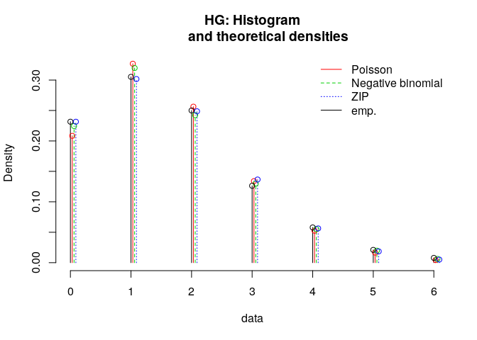

Goals scored in a soccer match: fitting distributions (Ver 2)
================
Magdiel Ablan
07/02/2019

## Introduction

This is part 1 of the project about goals scored in a football/soccer
match. The objetive is to analyze the fit of 3 different distributions
against observed data. The data are:

  - Home Goals
  - Away Goals
  - Total Goals

For each of these variables 3 distributions will be fit:

  - Poisson  
  - Negative Binomial
  - Zero-inflated Poisson

## Data preparation

First, we need to load all the required libraries:

``` r
# To read xlsx files:
library(readxl)

# To fit ditributions:
library(fitdistrplus)

# Add to R zip related distributions
library(VGAM)

# Legend for the plots
plot.legend <- c("Poisson", "Negative binomial","ZIP")
plot.legend2 <- c("Poisson", "Negative binomial")

# To print nicer tables
library(kableExtra)

# To know how to print tables 
outputFormat = knitr::opts_knit$get("rmarkdown.pandoc.to")
```

We now read the data. The `raw.xlsx` file contains only the columns of
data corresponding at the goal variables.

``` r
raw <- read_excel("data/raw.xlsx")
head(raw)
```

    ## # A tibble: 6 x 3
    ##      HG    AG   TOT
    ##   <dbl> <dbl> <dbl>
    ## 1     2     1     3
    ## 2     2     0     2
    ## 3     0     2     2
    ## 4     0     3     3
    ## 5     1     2     3
    ## 6     2     0     2

``` r
summary(raw)
```

    ##        HG              AG             TOT       
    ##  Min.   :0.000   Min.   :0.000   Min.   :0.000  
    ##  1st Qu.:1.000   1st Qu.:0.000   1st Qu.:2.000  
    ##  Median :1.000   Median :1.000   Median :3.000  
    ##  Mean   :1.568   Mean   :1.253   Mean   :2.821  
    ##  3rd Qu.:2.000   3rd Qu.:2.000   3rd Qu.:4.000  
    ##  Max.   :6.000   Max.   :6.000   Max.   :8.000

``` r
n <- length(raw$HG)
```

There are a total of 380 soccer games in the file. Summary stats look as
expected.

## Home goals (HG)

`HG.sum` is table that summarises the number of home goals from all the
matches

``` r
HG.sum <-table(raw$HG)
HG.sum
```

    ## 
    ##   0   1   2   3   4   5   6 
    ##  88 116  95  48  22   8   3

``` r
HG.goals <-as.numeric(names(HG.sum))
```

The density and CDF distribution are:

``` r
plotdist(raw$HG, histo = TRUE, discrete=TRUE)
```

<!-- -->

We now fit the poisson distribution to this data. The only parameter of
the poisson is the mean, lambda:

``` r
HG.pois <- fitdist(raw$HG,"pois")
HG.pois
```

    ## Fitting of the distribution ' pois ' by maximum likelihood 
    ## Parameters:
    ##        estimate Std. Error
    ## lambda 1.568421   0.064245

Likewise, we fit the negative binomial, using the alternative
parametrization with size (target for number of successful trials) and
mean (mu):

``` r
HG.nbinom <- fitdist(raw$HG,"nbinom")
HG.nbinom
```

    ## Fitting of the distribution ' nbinom ' by maximum likelihood 
    ## Parameters:
    ##       estimate  Std. Error
    ## size 15.543086 12.95624842
    ## mu    1.568313  0.06740344

Finally, we fit the ZIP distribution using the functions provided in the
`countreg` package. Since this is not one of the starndard distributions
provided in the `fitdistrplus` package, we need to provide starting
values for their parameters \(\pi\) and \(\lambda\). These are momentum
estimators based on the mean and variance of the data

``` r
m <- mean(raw$HG)
s <- var(raw$HG)
lambdaI <- (s + m^2)/m - 1
lambdaI
```

    ## [1] 1.667321

``` r
piI <- (s-m)/(s+m^2-m)
piI
```

    ## [1] 0.05931689

Provided with these initial values we continue with the
`fitdistr`function as
    before:

``` r
HG.zip <-fitdist(raw$HG,"zipois",start=list(lambda=lambdaI,pstr0=piI))
```

    ## Warning in fitdist(raw$HG, "zipois", start = list(lambda = lambdaI, pstr0
    ## = piI)): The dzipois function should return a zero-length vector when input
    ## has length zero

    ## Warning in fitdist(raw$HG, "zipois", start = list(lambda = lambdaI, pstr0
    ## = piI)): The pzipois function should return a zero-length vector when input
    ## has length zero

``` r
HG.zip
```

    ## Fitting of the distribution ' zipois ' by maximum likelihood 
    ## Parameters:
    ##          estimate Std. Error
    ## lambda 1.64847429 0.08664640
    ## pstr0  0.04853099 0.03321467

The maximum likelihood estimators returned by the `fitdistr` are very
similar to the previous ones. Also, as seen shortly, provide a good fit
of the data so we can safely ignore the warning.

We now compare graphically the fit of these three distributions:

``` r
par(mfrow=c(2,2))
denscomp(list(HG.pois, HG.nbinom, HG.zip), fittype = "o" ,legendtext = plot.legend,main="HG: Histogram
         and theoretical densities")
cdfcomp(list(HG.pois, HG.nbinom,HG.zip), legendtext = plot.legend,main="HG: Empirical
         and theoretical CDFs") 
ppcomp(list(HG.pois, HG.nbinom,HG.zip), legendtext = plot.legend,main="HG: P-P plot")
qqcomp(list(HG.pois, HG.nbinom,HG.zip), legendtext = plot.legend,main="HG: Q-Q plot")
```

<!-- -->

All the distribution seem very close to the data. However, a zoom in the
first graph shows an improvement with the ZIP adjusted model specially
for the values of zero and
one:

``` r
denscomp(list(HG.pois, HG.nbinom,HG.zip), fittype = "o" ,legendtext = plot.legend,main="HG: Histogram
         and theoretical densities")
```

<!-- -->

More formally, we can run goodness of fit statistics to evaluate which
one has the best
fit:

``` r
gofstat(list(HG.pois, HG.nbinom,HG.zip),fitnames=c("Poisson","Negative binomial","ZIP"))
```

    ## Chi-squared statistic:  2.794124 0.5189905 0.5476092 
    ## Degree of freedom of the Chi-squared distribution:  4 3 3 
    ## Chi-squared p-value:  0.5928475 0.9146999 0.9083141 
    ## Chi-squared table:
    ##      obscounts theo Poisson theo Negative binomial   theo ZIP
    ## <= 0        88    79.182095               85.28778  87.985022
    ## <= 1       116   124.190865              121.49858 114.640253
    ## <= 2        95    97.391783               92.10959  94.490754
    ## <= 3        48    50.917108               49.36700  51.921860
    ## <= 4        22    19.964866               20.97519  21.397963
    ## > 4         11     8.353283               10.76186   9.564148
    ## 
    ## Goodness-of-fit criteria
    ##                                 Poisson Negative binomial      ZIP
    ## Akaike's Information Criterion 1217.134          1217.432 1217.046
    ## Bayesian Information Criterion 1221.074          1225.312 1224.926

These results suggest that both the negative binomial and the ZIP
distribution are good models for the data.

We now repeat this analysis for the two other variables in the data set,
away team goals and total goals.

## Away goals (AG)

`AG.sum` is table that summarises the number of away goals from all the
matches

``` r
AG.sum <-table(raw$AG)
AG.sum
```

    ## 
    ##   0   1   2   3   4   5   6 
    ## 119 122  87  36   9   6   1

``` r
AG.goals <-as.numeric(names(AG.sum))
```

The density and CDF distribution are:

``` r
plotdist(raw$AG, histo = TRUE, discrete=TRUE)
```

<!-- -->

We now fit the poisson distribution to this data. The only parameter of
the poisson is the mean, lambda:

``` r
AG.pois <- fitdist(raw$AG,"pois")
AG.pois
```

    ## Fitting of the distribution ' pois ' by maximum likelihood 
    ## Parameters:
    ##        estimate Std. Error
    ## lambda 1.252632 0.05741424

Likewise, we fit the negative binomial, using the alternative
parametrization with size (target for number of successful trials) and
mean (mu):

``` r
AG.nbinom <- fitdist(raw$AG,"nbinom")
AG.nbinom
```

    ## Fitting of the distribution ' nbinom ' by maximum likelihood 
    ## Parameters:
    ##       estimate Std. Error
    ## size 11.078065 8.34172578
    ## mu    1.252618 0.06057261

Finally, we fit the ZIP distribution. But before, we need to calculate
initial values for the parameters:

``` r
m <- mean(raw$AG)
s <- var(raw$AG)
lambdaI <- (s + m^2)/m - 1
lambdaI
```

    ## [1] 1.36427

``` r
piI <- (s-m)/(s+m^2-m)
piI
```

    ## [1] 0.08183009

``` r
AG.zip <-fitdist(raw$AG,"zipois",start=list(lambda=lambdaI,pstr0=piI))
```

    ## Warning in fitdist(raw$AG, "zipois", start = list(lambda = lambdaI, pstr0
    ## = piI)): The dzipois function should return a zero-length vector when input
    ## has length zero

    ## Warning in fitdist(raw$AG, "zipois", start = list(lambda = lambdaI, pstr0
    ## = piI)): The pzipois function should return a zero-length vector when input
    ## has length zero

``` r
AG.zip
```

    ## Fitting of the distribution ' zipois ' by maximum likelihood 
    ## Parameters:
    ##          estimate Std. Error
    ## lambda 1.35183074 0.08527612
    ## pstr0  0.07331414 0.04232258

As before, only a slight modification with respect to previous values.
We can safely ignore the warnings produced.

We now compare graphically the fit of these distributions:

``` r
par(mfrow=c(2,2))
denscomp(list(AG.pois, AG.nbinom,AG.zip), fittype = "o" ,legendtext = plot.legend,main="AG: Histogram
         and theoretical densities")
cdfcomp(list(AG.pois, AG.nbinom,AG.zip), legendtext = plot.legend,main="AG: Empirical
         and theoretical CDFs") 
ppcomp(list(AG.pois, AG.nbinom,AG.zip), legendtext = plot.legend,main="AG: P-P plot")
qqcomp(list(AG.pois, AG.nbinom,AG.zip), legendtext = plot.legend,main="AG: Q-Q plot")
```

<!-- -->

Let’s zoom in the first graph to see
better:

``` r
denscomp(list(AG.pois, AG.nbinom,AG.zip), fittype = "o" ,legendtext = plot.legend,main="AG: Histogram
         and theoretical densities")
```

<!-- -->

More formally, we can run goodness of fit statistics to evaluate which
one has the best
fit:

``` r
gofstat(list(AG.pois, AG.nbinom,AG.zip),fitnames=c("Poisson","Negative binomial","ZIP"))
```

    ## Chi-squared statistic:  2.614305 1.455916 0.3064251 
    ## Degree of freedom of the Chi-squared distribution:  3 2 2 
    ## Chi-squared p-value:  0.4549873 0.4828941 0.8579474 
    ## Chi-squared table:
    ##      obscounts theo Poisson theo Negative binomial  theo ZIP
    ## <= 0       119    108.58569              115.98350 118.98143
    ## <= 1       122    136.01787              130.52440 123.18159
    ## <= 2        87     85.19014               80.07384  83.26033
    ## <= 3        36     35.57062               35.46047  37.51796
    ## > 3         16     14.63568               17.95779  17.05869
    ## 
    ## Goodness-of-fit criteria
    ##                                 Poisson Negative binomial      ZIP
    ## Akaike's Information Criterion 1116.993          1116.878 1116.206
    ## Bayesian Information Criterion 1120.933          1124.759 1124.086

This time the ZIP distribution seem to be the best model for the data.

## Total goals (TOT)

`TOT.sum` is table that summarises the number of away goals from all the
matches

``` r
TOT.sum <-table(raw$TOT)
TOT.sum
```

    ## 
    ##  0  1  2  3  4  5  6  7  8 
    ## 22 55 99 84 65 32 16  5  2

``` r
TOT.goals <-as.numeric(names(TOT.sum))
```

The density and CDF distribution are:

``` r
plotdist(raw$TOT, histo = TRUE, discrete=TRUE)
```

<!-- -->

We now fit the poisson distribution to this data. The only parameter of
the poisson is the mean, lambda:

``` r
TOT.pois <- fitdist(raw$TOT,"pois")
TOT.pois
```

    ## Fitting of the distribution ' pois ' by maximum likelihood 
    ## Parameters:
    ##        estimate Std. Error
    ## lambda 2.821053  0.0861616

Likewise, we fit the negative binomial, using the alternative
parametrization with size (target for number of successful trials) and
mean (mu):

``` r
TOT.nbinom <- fitdist(raw$TOT,"nbinom")
TOT.nbinom
```

    ## Fitting of the distribution ' nbinom ' by maximum likelihood 
    ## Parameters:
    ##          estimate  Std. Error
    ## size 8.290583e+05 33.28288633
    ## mu   2.820907e+00  0.08615728

The size parameter is very large, specially as compared to the values
obtained for the home and away goal distribution.

The density plot for total goals does not suggest that the ZIP
distribution can be a good model for this data. In fact, when we try to
find initial values for the parameters this is what we get:

``` r
m <- mean(raw$TOT)
s <- var(raw$TOT)
lambdaI <- (s + m^2)/m - 1
lambdaI
```

    ## [1] 2.730004

``` r
piI <- (s-m)/(s+m^2-m)
piI
```

    ## [1] -0.03335113

\(\pi\) cannot be a negative number. Therefore, for the total goal
distribution we only fit Poisson and negative binomial models.

We now compare graphically the fit of these two distributions:

``` r
par(mfrow=c(2,2))
denscomp(list(TOT.pois, TOT.nbinom), fittype = "o" ,legendtext = plot.legend2,main="TOT: Histogram
         and theoretical densities")
cdfcomp(list(TOT.pois, TOT.nbinom), legendtext = plot.legend2,main="TOT: Empirical
         and theoretical CDFs") 
ppcomp(list(TOT.pois, TOT.nbinom), legendtext = plot.legend2,main="TOT: P-P plot")
qqcomp(list(TOT.pois, TOT.nbinom), legendtext = plot.legend2,main="TOT: Q-Q plot")
```

<!-- -->

Let’s zoom in the first graph to see
better:

``` r
denscomp(list(TOT.pois, TOT.nbinom), fittype = "o" ,legendtext = plot.legend2,main="TOT: Histogram
         and theoretical densities")
```

<!-- -->

More formally, we can run goodness of fit statistics to evaluate which
one has the best
fit:

``` r
gofstat(list(TOT.pois, TOT.nbinom),fitnames=c("Poisson","Negative binomial"))
```

    ## Chi-squared statistic:  2.925257 2.925661 
    ## Degree of freedom of the Chi-squared distribution:  5 4 
    ## Chi-squared p-value:  0.711508 0.5703419 
    ## Chi-squared table:
    ##      obscounts theo Poisson theo Negative binomial
    ## <= 0        22     22.62643               22.62984
    ## <= 1        55     63.83034               63.83645
    ## <= 2        99     90.03438               90.03814
    ## <= 3        84     84.66391               84.66297
    ## <= 4        65     59.71034               59.70660
    ## <= 5        32     33.68920               33.68540
    ## > 5         23     25.44540               25.44060
    ## 
    ## Goodness-of-fit criteria
    ##                                 Poisson Negative binomial
    ## Akaike's Information Criterion 1418.447          1420.447
    ## Bayesian Information Criterion 1422.387          1428.328

This shows an almost technical tie between the two. Based on the
chi-square test, the distribution of best fit would be the negative
binomial. However, the rather large size value might be an indication
that perhaps the Poisson distribution is a better model for this
variable.

## Expected goals for the Poisson distribution

This is the table for expected goals for the Poisson distribution using
the data on 380 games and the parameters estimated in the previous
sections.

``` r
max.goals <- max(HG.goals,AG.goals,TOT.goals)

# pois.dist has the expected goal count for poisson
pois.dist <- data.frame(goals=0:max.goals,HG=numeric(max.goals+1), 
                        AG=numeric(max.goals+1),TOT = numeric(max.goals+1))

for (i in 0:(max.goals)) {
  j <- i+1
 pois.dist$HG[j] <- dpois(pois.dist$goals[j],HG.pois$estimate["lambda"])*n
 pois.dist$AG[j] <- dpois(pois.dist$goals[j],AG.pois$estimate["lambda"])*n
 pois.dist$TOT[j] <- dpois(pois.dist$goals[j],TOT.pois$estimate["lambda"])*n
}

pois.dist
```

    ##   goals           HG           AG       TOT
    ## 1     0  79.18209500 108.58569410 22.626428
    ## 2     1 124.19086480 136.01787001 63.830344
    ## 3     2  97.39178345  85.19013999 90.034381
    ## 4     3  50.91710784  35.57062000 84.663910
    ## 5     4  19.96486597  11.13922052 59.710337
    ## 6     5   6.26266322   2.79066789 33.689201
    ## 7     6   1.63708214   0.58261312 15.839835
    ## 8     7   0.36680487   0.10425709  6.383573
    ## 9     8   0.07191306   0.01632446  2.251049

## Expected goals for the negative binomial distribution

This is the table for expected goals for the negative binomial
distribution using the data on 380 games and the parameters estimated in
the previous sections.

``` r
nbinom.dist <- data.frame(goals=0:max.goals,HG=numeric(max.goals+1), 
                        AG=numeric(max.goals+1),TOT = numeric(max.goals+1))

for (i in 0:max.goals) {
  j <- i+1
  nbinom.dist$HG[j] <- dnbinom(nbinom.dist$goals[j],size = HG.nbinom$estimate["size"],
                               mu=HG.nbinom$estimate["mu"])*n
  nbinom.dist$AG[j] <- dnbinom(nbinom.dist$goals[j],size = AG.nbinom$estimate["size"],
                               mu=AG.nbinom$estimate["mu"])*n
  nbinom.dist$TOT[j] <- dnbinom(nbinom.dist$goals[j],size = TOT.nbinom$estimate["size"],
                                mu=TOT.nbinom$estimate["mu"])*n
}

nbinom.dist
```

    ##   goals          HG           AG       TOT
    ## 1     0  85.2877782 115.98350370 22.629841
    ## 2     1 121.4985775 130.52440076 63.836451
    ## 3     2  92.1095940  80.07383864 90.038136
    ## 4     3  49.3670014  35.46046758 84.662974
    ## 5     4  20.9751905  12.67824103 59.706599
    ## 6     5   7.5140866   3.88388339 33.685396
    ## 7     6   2.3579673   1.05725630 15.837268
    ## 8     7   0.6651120   0.26203088  6.382232
    ## 9     8   0.1717771   0.06015144  2.250471

## Expected goals for the ZIP distribution

This is the table for expected goals for the ZIP distribution using the
data on 380 games and the parameters estimated in the previous sections.

``` r
zip.dist <- data.frame(goals=0:max.goals,HG=numeric(max.goals+1), 
                        AG=numeric(max.goals+1))

for (i in 0:max.goals) {
  j <- i+1
  zip.dist$HG[j] <- dzipois(zip.dist$goals[j],lambda = HG.zip$estimate["lambda"],
                               pstr0=HG.zip$estimate["pstr0"])*n
  zip.dist$AG[j] <- dzipois(zip.dist$goals[j],lambda = AG.zip$estimate["lambda"],
                               pstr0=AG.zip$estimate["pstr0"])*n
  
}

zip.dist
```

    ##   goals           HG          AG
    ## 1     0  87.98502236 118.9814271
    ## 2     1 114.64025254 123.1815945
    ## 3     2  94.49075445  83.2603328
    ## 4     3  51.92185978  37.5179590
    ## 5     4  21.39796274  12.6794825
    ## 6     5   7.05479829   3.4281028
    ## 7     6   1.93827560   0.7723691
    ## 8     7   0.45645678   0.1491589
    ## 9     8   0.09405716   0.0252047

## By way of conclusion

The following table summarizes the fit of the given
models:

``` r
lambdas<-round(c(HG.pois$estimate["lambda"],AG.pois$estimate["lambda"],TOT.pois$estimate["lambda"]),2)
mus <- round(c(HG.nbinom$estimate["mu"],AG.nbinom$estimate["mu"],TOT.nbinom$estimate["mu"]),2)
sizes <-round(c(HG.nbinom$estimate["size"],AG.nbinom$estimate["size"],TOT.nbinom$estimate["size"]),2)
pis <- round(c(HG.zip$estimate["pstr0"],AG.zip$estimate["pstr0"],NA),2)
Zlambdas<-round(c(HG.zip$estimate["lambda"],AG.zip$estimate["lambda"],NA),2)
best<-c("Negative binomial or ZIP","ZIP","Poisson")
sum.tab <- data.frame(lambda=lambdas,mu=mus,size=sizes,pi=pis,zlambda=Zlambdas,best=best)
row.names(sum.tab)<-c("Home","Away","Total")
kable(sum.tab,col.names=c("$\\lambda$", "$\\mu$", "n", "$\\pi$","$\\lambda$","Best model"),
      booktabs=T,escape=T)  %>%
  kable_styling() %>%
  add_header_above(c(" " = 1, "Poisson" = 1, "Negative binomial" = 2, "ZIP" = 2," "=1),align="c")
```

<table class="table" style="margin-left: auto; margin-right: auto;">

<thead>

<tr>

<th style="border-bottom:hidden" colspan="1">

</th>

<th style="border-bottom:hidden; padding-bottom:0; padding-left:3px;padding-right:3px;text-align: center; " colspan="1">

<div style="border-bottom: 1px solid #ddd; padding-bottom: 5px; ">

Poisson

</div>

</th>

<th style="border-bottom:hidden; padding-bottom:0; padding-left:3px;padding-right:3px;text-align: center; " colspan="2">

<div style="border-bottom: 1px solid #ddd; padding-bottom: 5px; ">

Negative
binomial

</div>

</th>

<th style="border-bottom:hidden; padding-bottom:0; padding-left:3px;padding-right:3px;text-align: center; " colspan="2">

<div style="border-bottom: 1px solid #ddd; padding-bottom: 5px; ">

ZIP

</div>

</th>

<th style="border-bottom:hidden" colspan="1">

</th>

</tr>

<tr>

<th style="text-align:left;">

</th>

<th style="text-align:right;">

\(\lambda\)

</th>

<th style="text-align:right;">

\(\mu\)

</th>

<th style="text-align:right;">

n

</th>

<th style="text-align:right;">

\(\pi\)

</th>

<th style="text-align:right;">

\(\lambda\)

</th>

<th style="text-align:left;">

Best model

</th>

</tr>

</thead>

<tbody>

<tr>

<td style="text-align:left;">

Home

</td>

<td style="text-align:right;">

1.57

</td>

<td style="text-align:right;">

1.57

</td>

<td style="text-align:right;">

15.54

</td>

<td style="text-align:right;">

0.05

</td>

<td style="text-align:right;">

1.65

</td>

<td style="text-align:left;">

Negative binomial or ZIP

</td>

</tr>

<tr>

<td style="text-align:left;">

Away

</td>

<td style="text-align:right;">

1.25

</td>

<td style="text-align:right;">

1.25

</td>

<td style="text-align:right;">

11.08

</td>

<td style="text-align:right;">

0.07

</td>

<td style="text-align:right;">

1.35

</td>

<td style="text-align:left;">

ZIP

</td>

</tr>

<tr>

<td style="text-align:left;">

Total

</td>

<td style="text-align:right;">

2.82

</td>

<td style="text-align:right;">

2.82

</td>

<td style="text-align:right;">

829058.32

</td>

<td style="text-align:right;">

NA

</td>

<td style="text-align:right;">

NA

</td>

<td style="text-align:left;">

Poisson

</td>

</tr>

</tbody>

</table>
